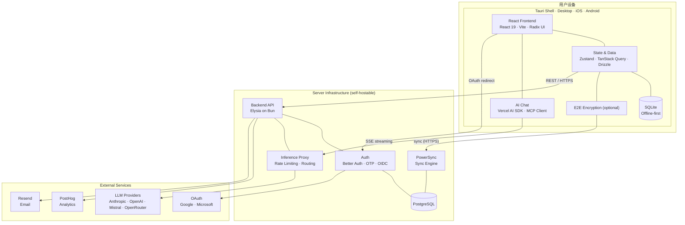

# 架构概览

> Thunderbolt 系统架构设计

## 1. 核心架构原则

| 原则 | 说明 |
|------|------|
| 离线优先 | 本地 SQLite 为数据源，应用无需网络 |
| 跨平台 | 单一 React 代码库支持所有平台 |
| 模型无关 | LLM 调用通过后端推理代理 |
| 自部署 | 完整服务器栈可自部署 |
| E2E 加密 | 可选端到端加密 |

## 2. 系统架构图

## 3. 客户端架构

### 3.1 跨平台支持

单一 React + Vite 代码库支持：

| 平台 | 运行时 |
|------|--------|
| Browser | PWA with COEP/COOP headers |
| Desktop | Tauri 2 (macOS, Windows, Linux) |
| Mobile | Tauri 2 (iOS, Android) |

### 3.2 本地状态

| 技术 | 用途 |
|------|------|
| Zustand | 客户端状态 |
| TanStack Query | 服务端状态、缓存 |
| SQLite | 本地持久化 (WA-SQLite in browsers, native SQLite under Tauri) |
| Drizzle | ORM |

## 4. 后端架构

### 4.1 技术栈

| 技术 | 用途 |
|------|------|
| Elysia | Web 框架 (typed end-to-end) |
| Bun | 运行时 (毫秒级启动) |
| Drizzle | ORM (schema-first) |
| Better Auth | 认证 (OTP、OAuth、OIDC) |
| React Email + Resend | 邮件模板 |
| OpenTelemetry | 可观测性 |

### 4.2 路由前缀

| 前缀 | 用途 |
|------|------|
| `/api/auth/*` | Better Auth 认证流程 |
| `/v1/account/*` | 账户删除、设备注册 |
| `/v1/powersync/*` | PowerSync 令牌、客户端上传 |
| `/v1/inference/*` | LLM 推理代理 |
| `/v1/pro/*` | 组件数据代理 |
| `/v1/mcp-proxy/*` | MCP 直通 |
| `/v1/posthog/*` | PostHog 分析事件 |

## 5. 同步架构

### 5.1 PowerSync 同步

PowerSync 保持用户数据在每个设备上的完整副本：
- 写入先到本地 SQLite
- Delta stream 在 SQLite 和 PostgreSQL 之间同步
- 后端发放短期 JWT

### 5.2 两条同步路径

| 运行时 | 路径 | 原因 |
|--------|------|------|
| Chrome/Edge/Firefox | SharedWorker + transformers | 跨标签页共享一个连接；在 worker 内运行 E2E 加密 |
| Safari/iOS/Tauri | 主线程 transformer | SharedWorker 不支持；Tauri 阻塞 |

## 6. 第三方服务

| 服务 | 角色 | 可替换？ |
|------|------|----------|
| PowerSync | 客户端-服务器同步 | 可通过 Docker 自部署 |
| PostgreSQL | 所有数据的事实来源 | 否 |
| Keycloak | 默认 OIDC 提供商 | 可替换为任何 OIDC 兼容 IdP |
| Resend | 事务邮件投递 | 可替换为任何 SMTP |
| PostHog | 应用分析 (可选) | 可选 |
| AI providers | LLM 提供商 | 自带 |

## 7. 构建和发布

| 平台 | 构建方式 |
|------|----------|
| Web / Enterprise | Vite build → nginx (COEP/COOP/CORP headers) |
| Desktop | `bun tauri build` |
| Mobile | iOS → TestFlight, Android → Play Store |

## 8. 核心开发原则

- 优先 tasteful simplicity
- 优先 optimistic code 而非 defensive code
- 软删除优先 (Frontend: `deletedAt`; Backend: 软删除)
- TypeScript 不用 `any`
- 使用 `bun` 而非 `npm`
