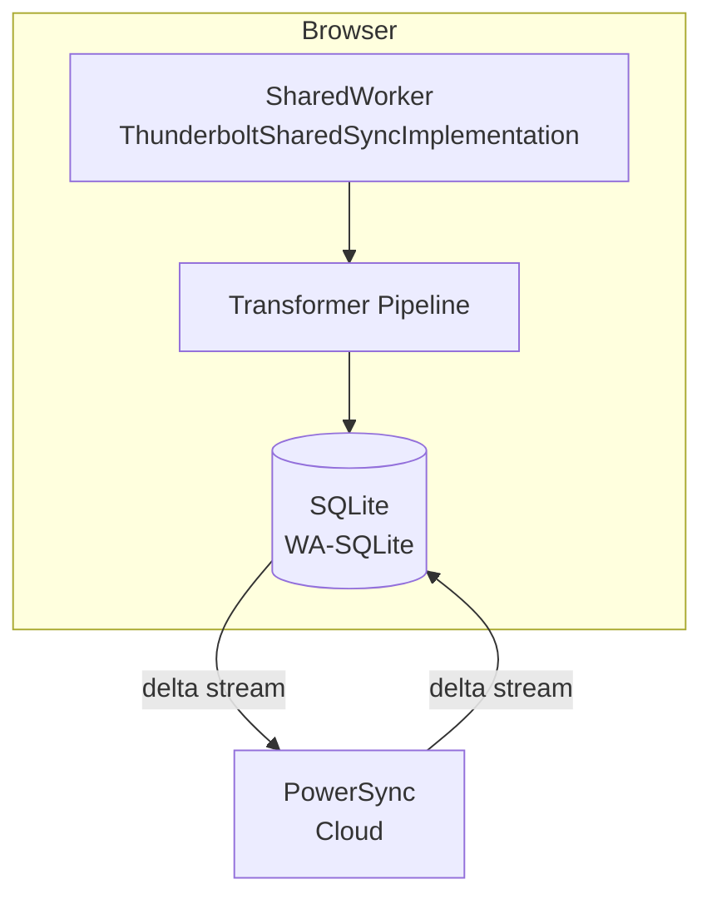
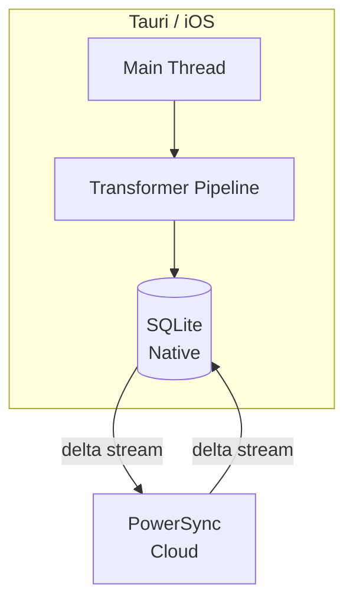

# 同步架构

> Thunderbolt PowerSync 离线数据同步

## 1. 同步概述

PowerSync 保持用户数据在每个设备上的完整副本。写入先到本地 SQLite，再通过 delta stream 在 SQLite 和后端 PostgreSQL 之间同步。

## 2. 两条同步路径

| 运行时 | 路径 | 原因 |
|--------|------|------|
| Chrome/Edge/Firefox | Custom SharedWorker + transformers | 跨标签页共享一个连接；在 worker 内运行 E2E 加密 |
| Safari/iOS/Tauri | Main-thread transformer pipeline | OPFS+COOP+COEP SharedWorker 不支持；Tauri 阻塞 |

## 3. SharedWorker 同步

### 3.1 架构



### 3.2 跨标签页共享

SharedWorker 允许跨标签页共享一个同步连接，减少资源占用。

### 3.3 E2E 加密

在 SharedWorker 内运行 E2E 加密，确保数据在传输前已加密。

### 3.4 powersync-web-internal

自定义 SharedWorker 扩展 `SharedSyncImplementation`，这是一个 `@internal` 类：

```typescript
// vite.config.ts
export default defineConfig({
  resolve: {
    alias: {
      'powersync-web-internal': '@powersync/web/lib/src',
    },
  },
});
```

**注意**: 升级 `@powersync/web` 时需验证该内部路径仍存在。

## 4. 主线程同步

### 4.1 架构

Safari、iOS 和 Tauri 使用主线程 transformer pipeline：



### 4.2 原因

- OPFS+COOP+COEP SharedWorker 在这些平台上不被支持
- Tauri 阻塞 SharedWorker

## 5. Schema 设计

### 5.1 应用 Schema

可自由索引：`users`, `accounts`, `sessions`, `challenges`, `envelopes`, `devices`, `waitlist`

### 5.2 同步 Schema

`shared/powersync-tables.ts` 中的表：
- 最小索引（主键 + 一个 `user_id` 索引）
- 无外键
- 某些表使用复合主键 `(id, user_id)` 或 `(key, user_id)`

## 6. JWT 认证

后端发放短期 JWT，PowerSync 接受这些 token 进行认证。

## 7. 添加新同步表

### 7.1 两步 PR 流程

**PR 1 (后端)**: 后端 schema、Drizzle 迁移、`shared/powersync-tables.ts`、`config.yaml` 同步规则。合并后运行迁移，更新 PowerSync Cloud dashboard 规则。

**PR 2 (前端)**: 前端 schema、DAL、默认值、协调、UI/逻辑。仅在 PR 1 的 dashboard 规则生效后合并。

### 7.2 警告

在同步规则更新前部署前端会导致静默同步失败——表在本地工作但不会跨设备复制。

## 8. Drizzle 迁移注意

添加新迁移时，务必验证 `backend/drizzle/meta/_journal.json` 包含新条目。Drizzle 通过 journal 发现待处理迁移——如果 SQL 文件和快照存在但 journal 条目缺失，迁移将不会运行。

## 9. Sync Middleware

参见 `docs/architecture/powersync-sync-middleware.md`：
- 同步数据转换中间件
- Custom SharedWorker (多标签页 + 加密)
- 添加新的 transformers
